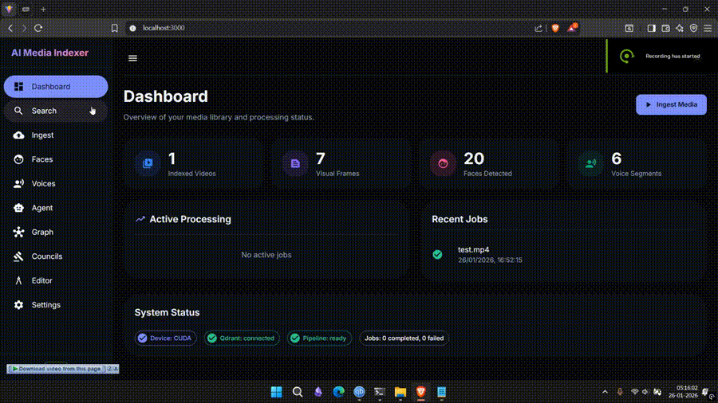
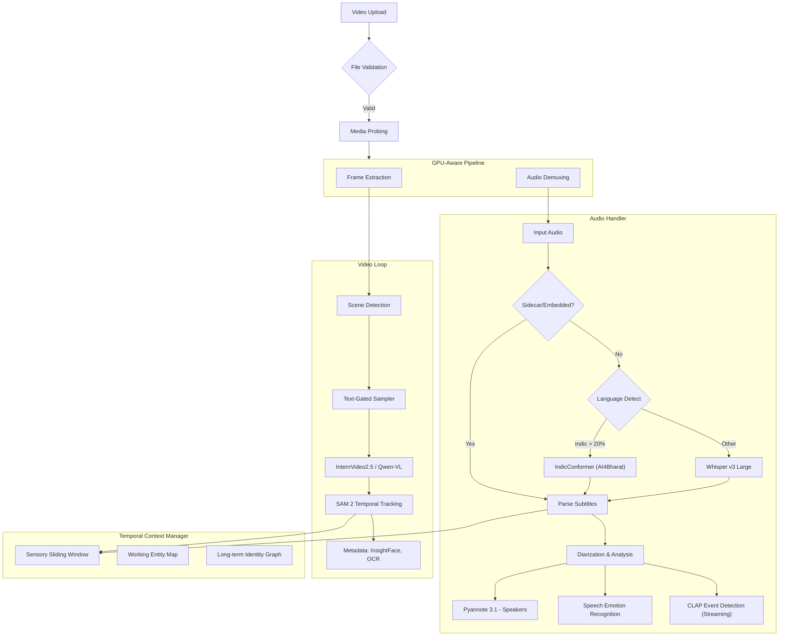
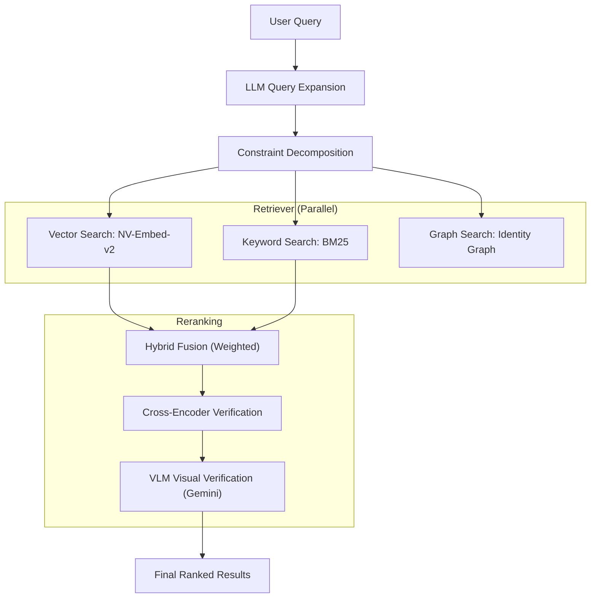

# AI-MEDIA-INDEXER

*Multimodal Intelligence for Media Discovery and Understanding*


*Built with state-of-the-art AI technologies:*


---

## Architecture Overview

The AI-Media-Indexer implements a massively parallel ingestion pipeline coordinated by a centralized resource arbiter. It processes audio and video tracks independently before fusing them into a temporal context for hyper-granular hybrid search.

### High-Fidelity Technical Schematic

### Current State Demo
> **Note**: This is the current state of the system. I am still strictly working on improving accuracy. Leaving a star on the repository helps ⭐!



> **Note**: This architecture diagram reflects the **actual running code**, removing theoretical voting blocks for transparency.

### Ingestion Logic Flow


### Search & Retrieval Flow


---

## Core Features

- **Parallel Ingestion Pipeline**: Independent audio/video processing with GPU-aware resource orchestration.
- **Multimodal Intelligence**:
    - **Audio**: **CLAP** for text-audio retrieval and **Whisper v3/IndicConformer** for ASR (Fallback strategy).
    - **Vision**: **InternVideo2.5** for temporal video understanding and **SAM 2** for tracking.
    - **Identity**: Temporal face tracking with **InsightFace** and **HDBSCAN** clustering.
- **Advanced Temporal Fusion**:
    - **3-Tier Memory**: Tracks entities across short-term (Window) and long-term (Graph) contexts.
    - **Fused Scenelets**: 5s window fusion of visual descriptions and dialogue transcripts.
- **Agentic Search Engine**:
    - **Hybrid Retrieval**: RRF Fusion (Vector + Keyword) across Multi-Vector Scenes.
    - **LLM Reranking**: Reasoning-based verification using **Gemini 1.5**.

## Capabilities

| Module | Technology | Capability |
|--------|------------|------------|
| **VLM Intelligence** | Gemini 1.5 Pro | Narrative synthesis & reasoning traces |
| **Action Recognition** | InternVideo2.5 | Dense motion description |
| **Face Identity** | InsightFace ArcFace | 512D biometric vectors |
| **ASR** | Whisper/AI4Bharat | Multi-lingual transcription (Fallback logic) |
| **Search Fusion** | RRF | Hybrid ranking (Dense + Sparse) |

## Tech Stack

- **Backend**: Python 3.12, FastAPI, Celery, Redis
- **Vector Database**: Qdrant with Multi-Vector support
- **frontend**: React 19, Vite, Tailwind CSS 4.0

## Getting Started

### 1. Requirements
Ensure you have Docker, Python 3.12, and Node.js 20+ installed.

### 2. Initialization
```powershell
./init.ps1
```

### 3. Running
```powershell
python run.py
cd web && npm run dev
```

---

## Configuration (`.env`)

| Variable | Default | Description |
|----------|---------|-------------|
| `QDRANT_HOST` | `localhost` | Vector DB host |
| `USE_INDIC_ASR` | `True` | Enable AI4Bharat for Indic langs |
| `ENABLE_HYBRID_SEARCH`| `True` | Use weighted RRF for ranking |

---

## Search Examples

- "Person in red shirt running fast" (Visual)
- "Crowd cheering in background" (Audio Events)
- "Prakash speaking near the door" (Identity + Voice)
- "Text 'EXIT' visible on sign" (OCR)