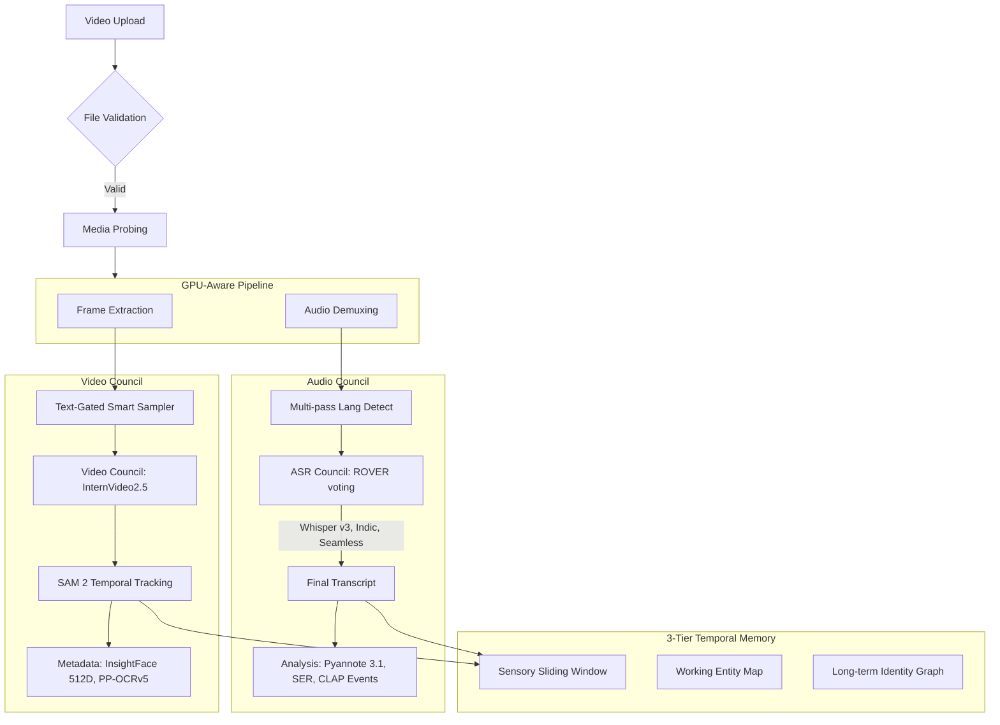
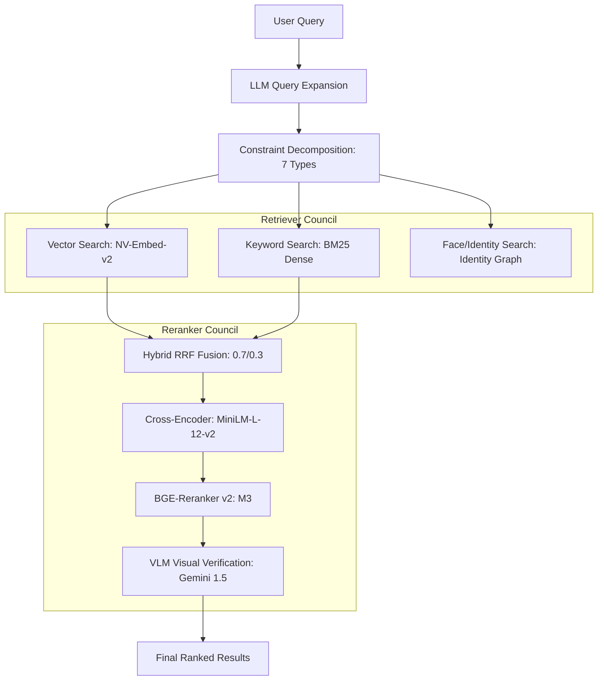

# AI-MEDIA-INDEXER

*Multimodal Intelligence for Media Discovery and Understanding*


*Built with state-of-the-art AI technologies:*


---

## Architecture Overview

The AI-Media-Indexer implements a massively parallel ingestion pipeline coordinated by a centralized resource arbiter. It processes audio and video tracks independently before fusing them into a temporal context for hyper-granular hybrid search.

### High-Fidelity Technical Schematic


### Ingestion Council Flow


### Search & Retrieval Council


---

## Core Features

- **Parallel Ingestion Pipeline**: Independent audio/video processing with GPU-aware resource orchestration (Semaphores in `processing/identity.py`).
- **Multimodal Intelligence**:
    - **Audio**: Multi-pass language detection, **ROVER word-level voting** between Whisper v3, IndicConformer, and SeamlessM4T.
    - **Vision**: **InternVideo2.5** for dense captioning, **SAM 2** for temporal visual tracking, and **PP-OCRv5** for Indic text extraction.
    - **Identity**: Temporal face tracking with **InsightFace ArcFace (512-dim)** and **HDBSCAN** global identity clustering.
- **Advanced Temporal Fusion**:
    - **3-Tier Memory**: XMem-inspired sensory (sliding window), working, and long-term memory tiers.
    - **Fused Scenelets**: 5s window fusion of visual descriptions and dialogue transcripts.
- **Agentic Search Engine**:
    - **Hybrid Retrieval**: RRF Fusion (0.7 Vector / 0.3 BM25) across **Multi-Vector Scenes** (Visual/Motion/Dialogue).
    - **LLM Reranking**: Reasoning-based verification using **Gemini 1.5** or Ollama, with reasoning traces.

## Capabilities

| Module | Technology | Capability |
|--------|------------|------------|
| **VLM Intelligence** | Gemini 1.5 Pro/Flash | Narrative synthesis, reasoning traces, re-ranking |
| **Action Recognition** | InternVideo2.5 | Dense motion description and semantic indexing |
| **Face Identity** | InsightFace ArcFace | 512D biometric vectors with temporal track building |
| **Object Tracking** | SAM 2 | Zero-shot visual segmentation and multi-frame tracking |
| **Search Fusion** | RRF + Cross-Encoders | Hybrid ranking (MiniLM-L-12-v2 + BGE-Reranker v2) |

## Tech Stack

- **Backend**: Python 3.12, FastAPI, Celery, Redis
- **Vector Database**: Qdrant with Multi-Vector support (Visual/Motion/Audio)
- **Visual Intelligence**: 
  - VLM: InternVideo2.5, LLAVA
  - Face: InsightFace, SFace
  - Detection: YOLO-World
  - OCR: PP-OCRv5
- **Audio Intelligence**: 
  - ASR: Whisper v3, AI4Bharat IndicASR
  - Diarization: Pyannote 4.0
  - Embeddings: WeSpeaker
- **LLM/VLM Providers**: Google Gemini 1.5, Ollama (Llama 3 / Moondream)
- **Frontend**: React 19, Vite, Tailwind CSS 4.0, Framer Motion

## Project Structure

```
AI-Media-Indexer/
├── api/                    # FastAPI route definitions
├── core/                   # Processing logic
│   ├── ingestion/         # Ingestion pipeline & task management
│   ├── retrieval/         # Search agents & RRF fusion
│   ├── processing/        # Model wrappers (ASR, VLM, Face)
│   └── storage/           # Qdrant & SQLite adapters
├── web/                    # Frontend assets
├── architecture.d2        # Deep architectural source (D2 Format)
└── init.ps1               # System initialization script
```

---

## Getting Started

### 1. Requirements
Ensure you have Docker, Python 3.12, and Node.js 20+ installed.

### 2. Initialization
```powershell
./init.ps1
```

### 3. Running the Application
```powershell
# Start Backend
python run.py

# Start Frontend
cd web
npm run dev
```

---

## Configuration

Settings are managed via `.env` (overrides `config.py` defaults).

| Variable | Default | Description |
|----------|---------|-------------|
| `QDRANT_HOST` | `localhost` | Vector DB host |
| `QDRANT_PORT` | `6333` | Vector DB port |
| `OLLAMA_MODEL` | `moondream` | Default VLM model |
| `GEMINI_API_KEY` | None | Google Gemini API Key |
| `USE_INDIC_ASR` | `True` | Enable AI4Bharat for Indic langs |
| `ENABLE_HYBRID_SEARCH`| `True` | Use weighted RRF for ranking |
| `FACE_RECOGNITION_THRESHOLD` | `0.45` | Global face matching threshold |

---

## Search Examples

| Query | Modalities Used |
|-------|-----------------|
| "Person in red shirt running fast" | Visual (SigLIP) + Action (InternVideo) |
| "Crowd cheering in background" | Audio Events (CLAP) |
| "Prakash speaking near the door" | Face ID + Voice ID + VLM |
| "Text 'EXIT' visible on sign" | OCR (PP-OCRv5) |

---

<!-- 
## Screenshots
[Coming Soon]
-->