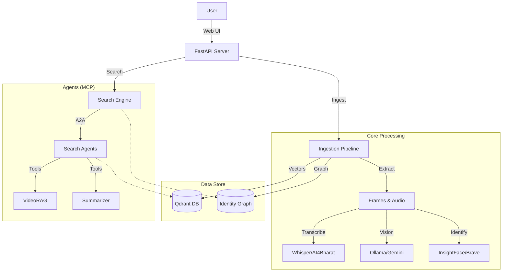

# AI-Media-Indexer

Commercial-grade AI engine for hyper-specific video search using identity, visual semantics, and audio.

## Quick Start

```powershell
# Prerequisites: Python 3.12+, Node.js 18+, Docker Desktop, Ollama

# 1. Clone and enter directory
git clone https://github.com/your-org/AI-Media-Indexer.git
cd AI-Media-Indexer

# 2. Copy environment file and configure
cp .env.example .env

# 3. Start everything (Docker services + Backend + Frontend)
./start.ps1 -Quick
```

**Services:**
- Frontend: [http://localhost:3000](http://localhost:3000)
- Backend API: [http://localhost:8000](http://localhost:8000)
- API Docs: [http://localhost:8000/docs](http://localhost:8000/docs)

> For detailed architecture documentation, see [docs/architecture.md](docs/architecture.md)

## Architecture Overview



## AI4Bharat Indic ASR Setup

For SOTA transcription of Indian languages (Tamil, Hindi, etc.), we support **AI4Bharat IndicConformer**.

### Option 1: Native (Recommended)
This uses the lightweight HuggingFace model (~600MB).
```bash
# Enabled by default if language is 'ta', 'hi', etc.
# config.py: use_indic_asr = True
```

### Option 2: Docker Container (SOTA Quality)
Use the NVIDIA NeMo backend (requires ~5GB VRAM and Linux/WSL).

1. **Create Dockerfile.asr**:
```dockerfile
FROM python:3.10-slim
RUN apt-get update && apt-get install -y libsndfile1 ffmpeg
RUN pip install nemo_toolkit[asr]
COPY . /app
WORKDIR /app
RUN pip install -r requirements.txt
CMD ["python", "api/server.py"]
```
2. **Run**:
```bash
docker build -t ai-media-asr -f Dockerfile.asr .
docker run --gpus all -v $(pwd)/data:/app/data ai-media-asr
```

---

## Configuration

Settings are managed via `.env` (overrides `config.py` defaults).

| Variable | Default | Description |
|----------|---------|-------------|
| **Core** | | |
| `PROJECT_ROOT` | (Auto) | Root directory path |
| `QDRANT_HOST` | `localhost` | Vector DB host |
| `QDRANT_PORT` | `6333` | Vector DB port |
| `LOG_LEVEL` | `INFO` | Logging verbosity |
| **AI Models** | | |
| `OLLAMA_BASE_URL` | `http://localhost:11434` | Ollama API URL |
| `OLLAMA_MODEL` | `moondream` | Vision model (moondream/llava) |
| `OLLAMA_VISION_MODEL`| `moondream:latest` | Vision model tag |
| `GEMINI_API_KEY` | None | Google Gemini API Key |
| `BRAVE_API_KEY` | None | Brave Search API (Identity Enrichment) |
| `HF_TOKEN` | None | HuggingFace Token (Speaker Diarization) |
| **Features** | | |
| `USE_INDIC_ASR` | `True` | Enable AI4Bharat for Indic langs |
| `AUTO_DETECT_LANGUAGE`| `True` | Detect audio language automatically |
| `ENABLE_VISUAL_EMBEDDINGS`| `True` | Use SigLIP for visual search |
| `ENABLE_HYBRID_SEARCH`| `True` | Use weights for ranking |
| **Embeddings** | | |
| `TEXT_EMBEDDING_DIM` | `1024` | Text vector dimension (BGE-M3) |
| `VISUAL_EMBEDDING_DIM` | `1024` | Visual vector dimension |
| `SIGLIP_MODEL` | `google/siglip...` | Visual embedding model |
| **Tuning (New)** | | |
| `FACE_MATCH_WEIGHT` | `0.20` | Boost for identity matches |
| `SPEAKER_MATCH_WEIGHT`| `0.15` | Boost for speaker matches |

---

## Tools

### Search Optimization
Tune search weights for your dataset:
```bash
python tools/tune_search.py
```

### Agent Verification
Verify MCP server and tools:
```bash
python tests/verifymcp.py
```

---

## Response Schema
...

```json
{
  "video_id": "abc123",
  "file_path": "/path/to/video.mp4",
  "start_time": 10.0,
  "end_time": 15.0,
  "score": 0.87,
  "match_reasons": ["identity_face", "semantic_visual", "vlm_verified"],
  "explanation": "Man in blue shirt bowling shown clearly",
  "thumbnail_url": "/api/media/thumbnail?path=...&time=10.0"
}
```

Score is normalized 0.0-1.0 (80% VLM weight when reranking enabled).

---

For detailed docs: `docs/development.md`