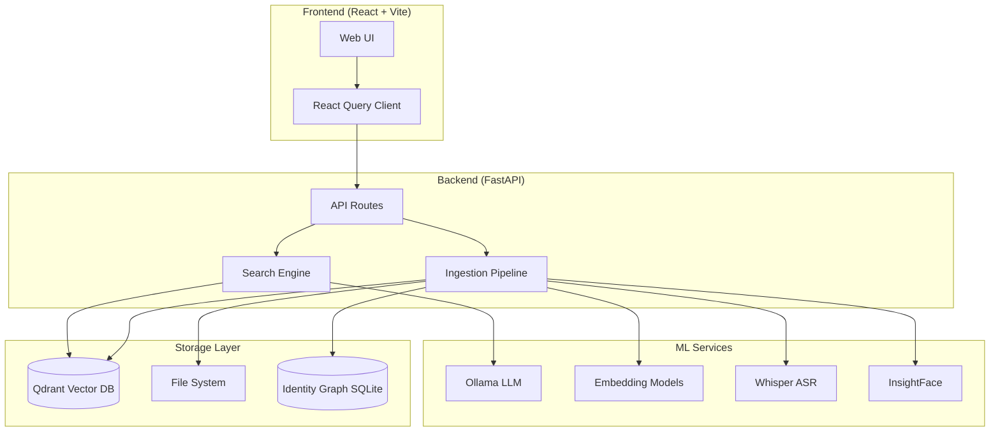
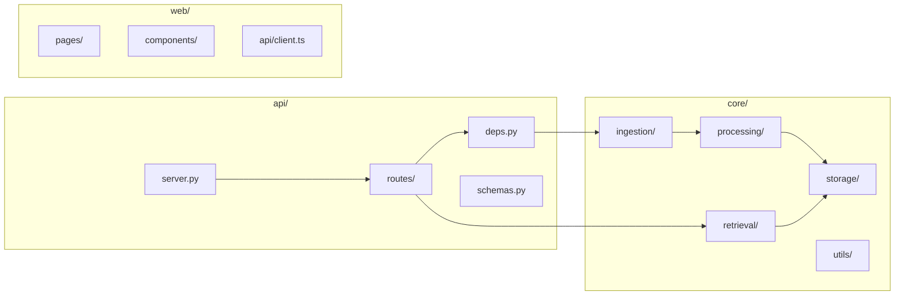
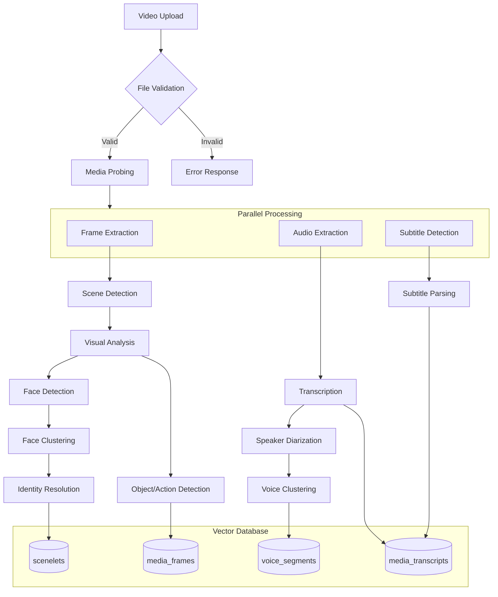
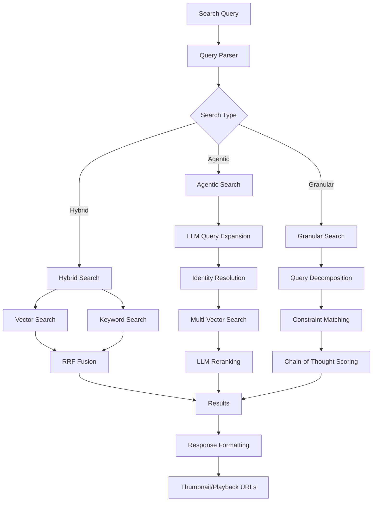

# AI-Media-Indexer Architecture

This document describes the system architecture, component interactions, and data flows.

## System Overview

AI-Media-Indexer is a multimodal video search and indexing system that combines:
- **Visual Analysis**: Frame extraction, object detection, face recognition
- **Audio Processing**: Transcription, speaker diarization, voice clustering  
- **Semantic Search**: Hybrid vector+keyword search with LLM reranking
- **Identity Resolution**: Face/voice cluster to named person mapping

---

## High-Level Architecture

---

## Component Diagram

---

## Ingestion Flow

---

## Search Flow

---

## Key Components

### 1. Ingestion Pipeline (`core/ingestion/`)
| File | Purpose |
|------|---------|
| `pipeline.py` | Main orchestrator for video processing |
| `jobs.py` | Job queue management and status tracking |
| `celery_app.py` | Distributed processing with Celery |

### 2. Processing (`core/processing/`)
| File | Purpose |
|------|---------|
| `transcriber.py` | Whisper-based transcription |
| `indic_transcriber.py` | Tamil/Hindi ASR with NeMo |
| `vision_analyzer.py` | LLM vision analysis via Ollama |
| `face_clustering.py` | HDBSCAN face clustering |
| `voice_clustering.py` | Speaker clustering |
| `segmentation.py` | Scene/shot detection |

### 3. Retrieval (`core/retrieval/`)
| File | Purpose |
|------|---------|
| `agentic_search.py` | SOTA search with LLM reranking |
| `advanced_query.py` | Multi-constraint query handling |
| `rag.py` | VideoRAG orchestrator |
| `engine.py` | Core search engine |

### 4. Storage (`core/storage/`)
| File | Purpose |
|------|---------|
| `db.py` | Qdrant vector database wrapper |
| `identity_graph.py` | SQLite identity mapping |

---

## API Endpoints

### Media
- `GET /media` - Stream video with range support
- `GET /media/segment` - Extract clip segment
- `GET /media/thumbnail` - Dynamic frame thumbnail

### Search
- `GET /search` - Multi-modal semantic search
- `GET /search/hybrid` - SOTA hybrid search
- `POST /search/granular` - Complex query handling

### Ingestion
- `POST /ingest` - Start video ingestion
- `GET /ingest/jobs` - List job statuses
- `DELETE /ingest/jobs/{id}` - Cancel job

### Identity Management
- `GET /faces/clusters` - Get face clusters
- `PUT /faces/{id}/identity` - Assign identity
- `POST /faces/merge` - Merge clusters
- `GET /voices/clusters` - Get speaker clusters

---

## Technology Stack

| Layer | Technology |
|-------|------------|
| Frontend | React, Vite, TanStack Query, TailwindCSS |
| Backend | FastAPI, Uvicorn, Python 3.12 |
| Vector DB | Qdrant |
| LLM | Ollama (local), Gemini (optional) |
| Embeddings | BAAI/bge-m3 |
| Vision | InsightFace, OpenCV |
| ASR | Whisper, NeMo |
| Task Queue | Celery + Redis (optional) |
| Observability | Langfuse (optional) |
