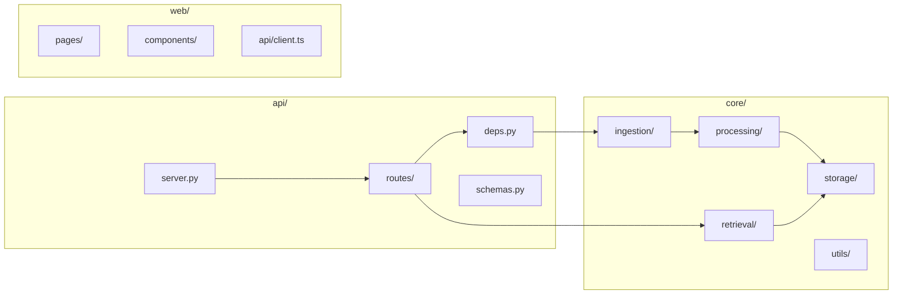
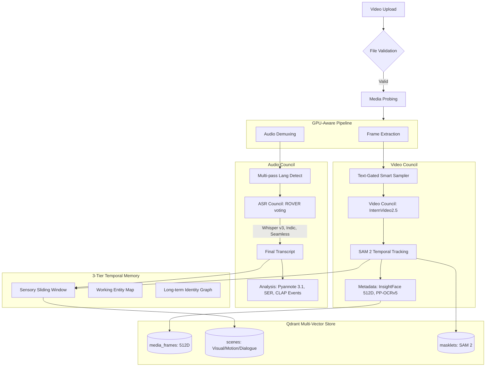
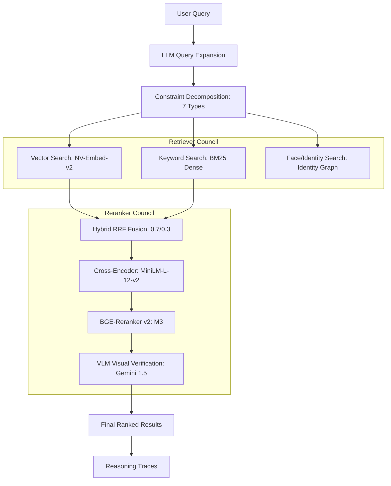

# AI-Media-Indexer Architecture

This document describes the system architecture, component interactions, and data flows.

## System Overview

AI-Media-Indexer is a multimodal video search and indexing system that combines:
- **Visual Analysis**: Frame extraction, object detection, face recognition
- **Audio Processing**: Transcription, speaker diarization, voice clustering  
- **Semantic Search**: Hybrid vector+keyword search with LLM reranking
- **Identity Resolution**: Face/voice cluster to named person mapping

---

## High-Level Architecture

---

## Component Diagram

---

## Ingestion Flow (Ultra-High-Fidelity)

---

## Search Flow (Agentic & Hybrid)

---

## Key Components

### 1. Ingestion Pipeline (`core/ingestion/`)
| File | Purpose |
|------|---------|
| `pipeline.py` | Main orchestrator for video processing |
| `jobs.py` | Job queue management and status tracking |
| `celery_app.py` | Distributed processing with Celery |

### 2. Processing (`core/processing/`)
| File | Purpose |
|------|---------|
| `asr_council.py` | ROVER-based multi-ASR consensus |
| `vlm_council.py` | Multi-model frame description with synthesis |
| `temporal_context.py` | 3-tier XMem temporal memory management |
| `identity.py` | InsightFace 512D + temporal track building |
| `scene_aggregator.py` | Fusing visual/dialogue into Scenelets |
| `indic_transcriber.py` | AI4Bharat/NeMo Indic ASR wrapper |

### 3. Retrieval (`core/retrieval/`)
| File | Purpose |
|------|---------|
| `reranker.py` | RRF fusion + Cross-Encoder reranking council |
| `agentic_search.py` | Constraint decomposition & search agents |
| `late_interaction.py` | ColBERT-style MaxSim scoring |
| `hitl_feedback.py` | Human-in-the-loop scoring boosts |

### 4. Storage (`core/storage/`)
| File | Purpose |
|------|---------|
| `db.py` | Qdrant vector database wrapper |
| `identity_graph.py` | SQLite identity mapping |

---

## API Endpoints

### Media
- `GET /media` - Stream video with range support
- `GET /media/segment` - Extract clip segment
- `GET /media/thumbnail` - Dynamic frame thumbnail

### Search
- `GET /search` - Multi-modal semantic search
- `GET /search/hybrid` - SOTA hybrid search
- `POST /search/granular` - Complex query handling

### Ingestion
- `POST /ingest` - Start video ingestion
- `GET /ingest/jobs` - List job statuses
- `DELETE /ingest/jobs/{id}` - Cancel job

### Identity Management
- `GET /faces/clusters` - Get face clusters
- `PUT /faces/{id}/identity` - Assign identity
- `POST /faces/merge` - Merge clusters
- `GET /voices/clusters` - Get speaker clusters

---

## Technology Stack

| Layer | Technology |
|-------|------------|
| Vector DB | Qdrant (Multi-Vector Scene Schema) |
| LLM | Gemini 1.5 Pro (Reasoning), Ollama (Local) |
| Embeddings | NV-Embed-v2 (7B), BGE-M3 (Hybrid) |
| Vision | InternVideo2.5, SAM 2, InsightFace ArcFace |
| ASR | Whisper v3, AI4Bharat, SeamlessM4T v2 |
| Reranking | MiniLM-L-12-v2, BGE-Reranker v2 |
| Memory | 3-Tier XMem Memory (Sensory/Working/LT) |
